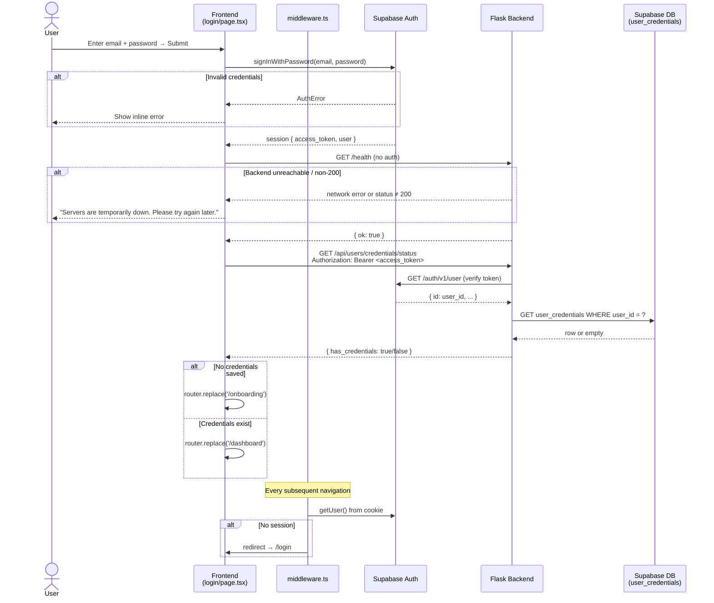
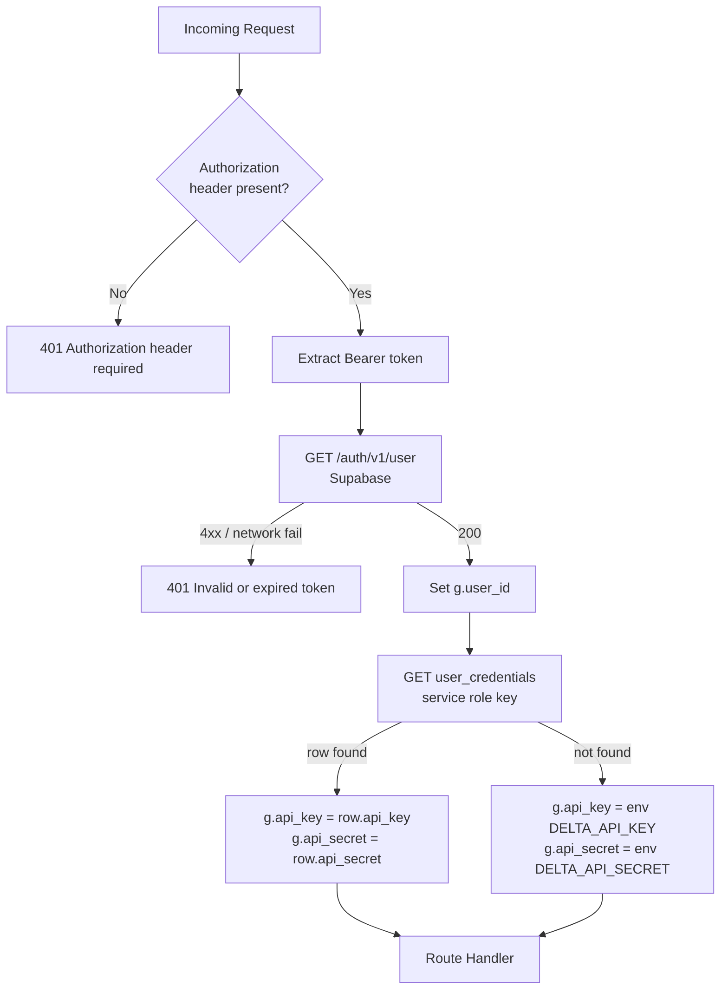
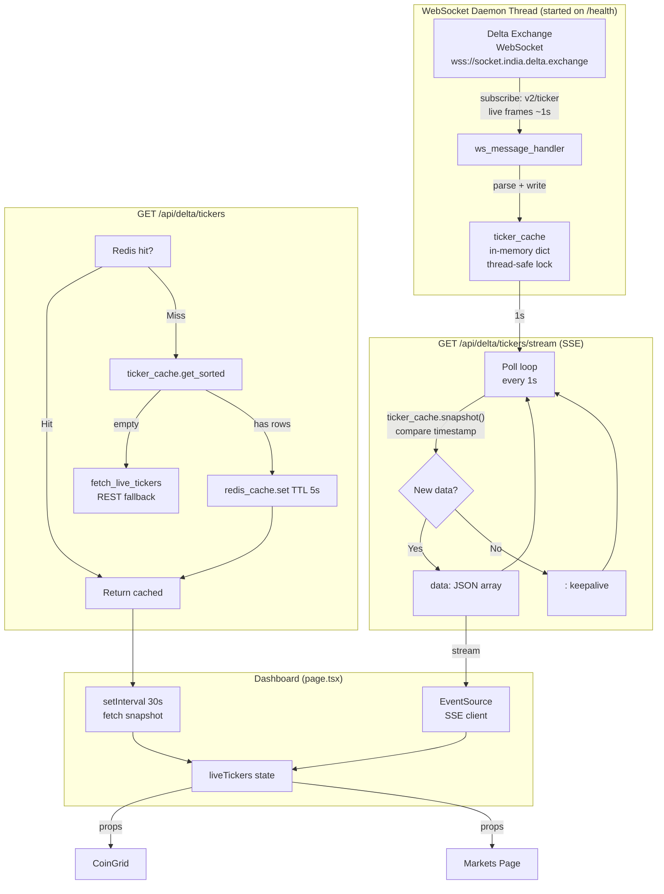
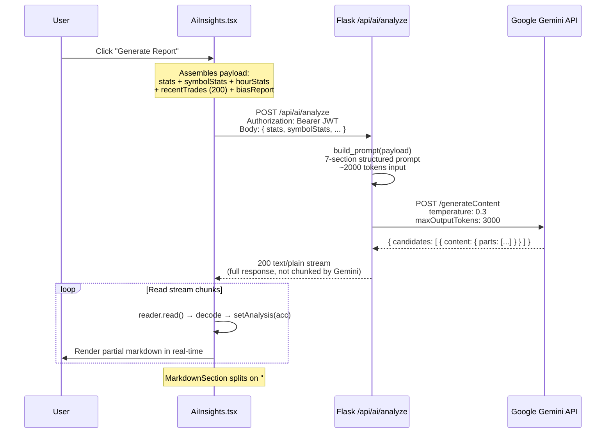
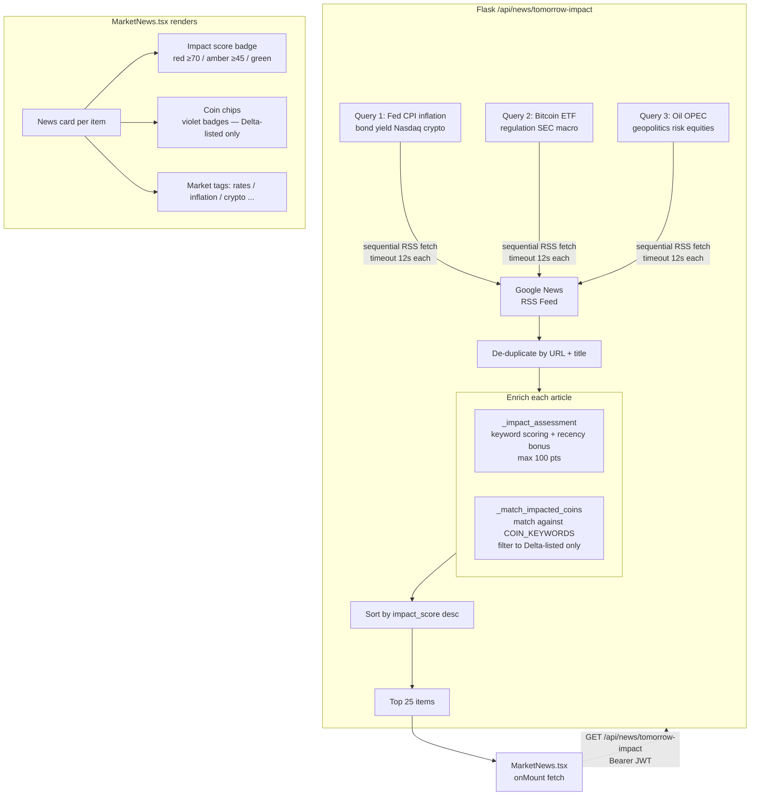
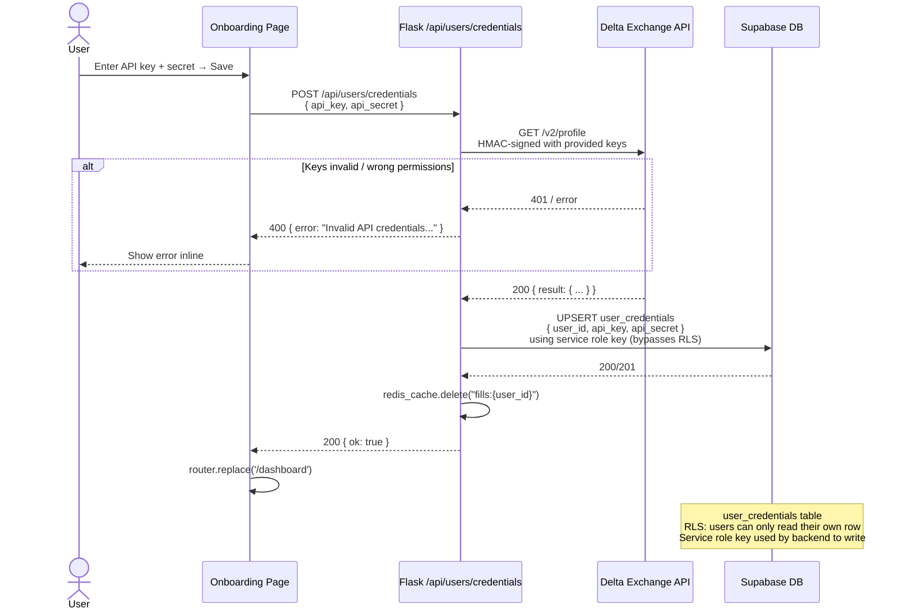

# TradeEdge — Complete System Flow

> All diagrams use [Mermaid](https://mermaid.js.org/) syntax. Rendered automatically on GitHub, GitLab, Notion, and most markdown viewers.

---

## 1. System Architecture Overview

```mermaid
graph TB
    subgraph Browser["🖥 Browser (Next.js 14)"]
        LP[Landing Page<br/>/]
        LG[Login / Signup<br/>/login  /signup]
        OB[Onboarding<br/>/onboarding]
        DB[Dashboard<br/>/dashboard]
        MK[Markets<br/>/markets]
        MW[middleware.ts<br/>Route Guard]
    end

    subgraph Backend["⚙ Flask Backend :5001"]
        direction TB
        HLTH["/health"]
        subgraph Routes
            R_FILLS["/api/delta/fills"]
            R_TICK["/api/delta/tickers"]
            R_STREAM["/api/delta/tickers/stream SSE"]
            R_AI["/api/ai/analyze<br/>/api/ai/trade-replay"]
            R_NEWS["/api/news/tomorrow-impact"]
            R_NOTIFY["/api/notify/trade-loss"]
            R_USERS["/api/users/credentials"]
        end
        AUTH["@require_auth<br/>middleware"]
        REDIS[(Redis Cache<br/>Upstash TLS)]
        TCACHE[ticker_cache<br/>in-memory]
        SCHED[Scheduler<br/>daemon thread]
    end

    subgraph External["☁ External Services"]
        SUPA[(Supabase<br/>Auth + DB)]
        DELTA_REST[Delta Exchange<br/>REST API]
        DELTA_WS[Delta Exchange<br/>WebSocket]
        GEMINI[Google Gemini<br/>2.5 Flash]
        GNEWS[Google News<br/>RSS Feed]
        RESEND[Resend<br/>Email API]
    end

    MW -->|"no session → redirect"| LG
    LG -->|"signInWithPassword"| SUPA
    LG -->|"/health check"| HLTH
    OB -->|"POST /api/users/credentials"| R_USERS
    DB -->|"authFetch (Bearer JWT)"| R_FILLS
    DB -->|"fetch (public)"| R_TICK
    DB -->|"EventSource"| R_STREAM
    DB -->|"authFetch"| R_AI
    DB -->|"authFetch"| R_NEWS
    MK -->|"fetch (public)"| R_TICK
    MK -->|"EventSource"| R_STREAM

    R_FILLS --> AUTH
    R_AI --> AUTH
    R_NEWS --> AUTH
    R_NOTIFY --> AUTH
    R_USERS --> AUTH
    AUTH -->|"verify JWT"| SUPA
    AUTH -->|"fetch credentials"| SUPA

    R_FILLS -->|"cache hit/miss"| REDIS
    R_FILLS -->|"cache miss"| DELTA_REST
    R_TICK -->|"cache hit/miss"| REDIS
    R_TICK -->|"cache miss"| TCACHE

    DELTA_WS -->|"live frames"| TCACHE
    TCACHE -->|"1s poll"| R_STREAM

    R_AI -->|"prompt + call"| GEMINI
    R_NEWS -->|"RSS fetch"| GNEWS
    R_NOTIFY -->|"prompt"| GEMINI
    R_NOTIFY -->|"send email"| RESEND
    SCHED -->|"daily"| GEMINI
    SCHED -->|"daily"| RESEND
    R_USERS -->|"read/write"| SUPA
```



---

## 2. Authentication & Login Flow



---

## 3. Per-Request Auth Middleware (Backend)



---

## 4. Fills Data Flow

```mermaid
flowchart LR
    FE[Dashboard\nfetchFills\nevery 30s]

    FE -->|"GET /api/delta/fills\nBearer JWT"| AUTH[@require_auth]
    AUTH --> CREDS{g.api_key\nset?}
    CREDS -- No --> E503[503 No credentials]
    CREDS -- Yes --> REDIS{Redis\nfills:user_id\nhit?}
    REDIS -- Hit --> CACHED[Return cached JSON]
    REDIS -- Miss --> DELTA[delta_fills.fetch_all\nHMAC-signed pagination\nLast 365 days]
    DELTA -->|"GET /v2/fills\n(paginated)"| DEXCH[(Delta Exchange\nREST API)]
    DEXCH --> PROC[delta_fills.process\nnormalise → Trade]
    PROC --> SAVE[redis_cache.set\nTTL 30s]
    SAVE --> RESP[Return JSON\nlist of Trade]
    CACHED --> FE
    RESP --> FE

    FE -->|"setState\ntrades"| UI[Dashboard\nUI re-render]
```

---

## 5. Realtime Ticker Flow



---

## 6. AI Analysis Flow



---

## 7. Trade Replay Flow (Copilot)

```mermaid
flowchart TD
    USER[User clicks a trade\nin the Replay list]
    USER --> QS[scoreTradeQuality\nclient-side\nA–F grade]
    QS --> DISP[Display quality card\nimmediately]

    USER --> CALL["POST /api/ai/trade-replay\n{ trade, context }"]
    CALL --> AUTH[@require_auth]
    AUTH --> PROMPT[build_trade_replay_prompt\n3 sections, max 250 words]
    PROMPT --> GEM[Gemini API\nmaxTokens: 900]
    GEM --> STREAM[Stream response\nback to browser]
    STREAM --> RENDER[Render line-by-line\nin analysis panel]

    subgraph Context sent to Gemini
        C1[Trade details: symbol, dir, price, size, PnL]
        C2[Quality score + factor breakdown]
        C3[5 trades prior to this one]
        C4[Overall account stats: WR, drawdown, avgWin]
    end
```

---

## 8. Market News Flow



---

## 9. Frontend Component Data Flow (Dashboard)

```mermaid
flowchart TD
    PAGE[dashboard/page.tsx\nState owner]

    subgraph State["State fetched by shell"]
        T[trades: Trade\nfills every 30s]
        LT[liveTickers: LiveTicker\nSSE stream + 30s poll]
        HC[hasCredentials: bool\nonce on mount]
        UE[userEmail: string\nonce on mount]
    end

    PAGE --> OV[Overview Tab]
    PAGE --> CO[Coins Tab]
    PAGE --> AI[AI Insights Tab]
    PAGE --> CP[Copilot Tab]
    PAGE --> NW[Market News Tab]

    subgraph OV["Overview Tab"]
        SC[StatsCards\nstats]
        ED[EquityDrawdownChart\ndrawdownData]
        TA[TimeAnalysis\nhourStats + dayStats]
        TT[TradeTable\nlast 50 trades]
    end

    subgraph CO["Coins Tab"]
        CG[CoinGrid\nsymbolStats + trades\n+ liveTickers]
    end

    subgraph AI["AI Insights Tab"]
        BIAS[Bias bars + health ring\nclient-side from trades]
        CAL[30-Day P&L Calendar\nclient-side from trades]
        COM[Commission Impact\nclient-side from stats]
        BEST[Best Setups\nclient-side from trades]
        GEN[Generate Report button\n→ POST /api/ai/analyze]
    end

    subgraph CP["Copilot Tab"]
        WARN[Live Warnings\ncomputeWarnings]
        RISK[Risk Tab\nDailyGuard + concentration]
        SESS[Session Tab\nhourly heatmap]
        DISC[Discipline Tab\nweekly scores]
        GOALS[Goals Tab\nlocalStorage targets]
        REPLAY[Trade Replay\n→ POST /api/ai/trade-replay]
    end

    subgraph NW["Market News Tab"]
        NEWS[MarketNews\nfetches independently\nonce on mount]
    end

    T --> SC & ED & TA & TT
    T & LT --> CG
    T --> BIAS & CAL & COM & BEST
    T --> WARN & RISK & SESS & DISC & GOALS & REPLAY
```



---

## 10. Onboarding & Credential Storage Flow


